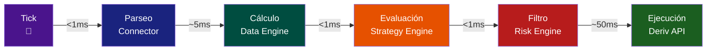
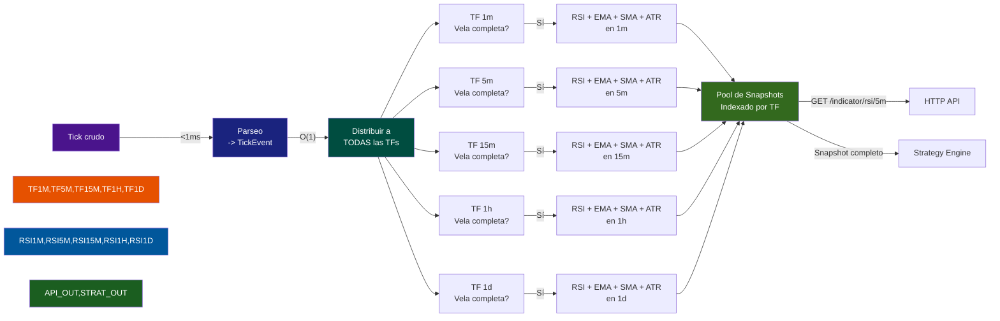

# 🏗️ Plan de Construcción — Ghost Trader

> **Versión:** 2.0 — 11/06/2026
> **Propósito:** Hoja de ruta para construir el asistente de trading en lenguaje natural, desglosado por módulos
> **Basado en:** Arquitectura v2 — Deriv API nativa

---

## 🧱 MÓDULOS DEL SISTEMA

```mermaid
flowchart TB
    subgraph DERIV[Mundo Exterior]
        A[Deriv API<br>ws.derivws.com]
    end

    subgraph GT[Ghost Trader — 1 Proceso Python]
        direction TB
        
        subgraph M1[📦 M1 — Deriv Connector]
            M1_WS[WebSocket persistente]
            M1_TICK[TickEvent]
            M1_ORDEN[Orden buy/sell]
        end

        subgraph M2[📦 M2 — Data Engine]
            M2_BUF[Buffer de ticks]
            M2_VELA[Agrupación → Velas]
            M2_IND[Indicadores<br>RSI · EMA · SMA · ATR · Vol]
        end

        subgraph M3[📦 M3 — Backtest Engine]
            M3_HIST[Datos históricos<br>ticks_history]
            M3_SIM[Simulación vela x vela]
            M3_MET[Métricas<br>Sharpe · Sortino · DD · PF]
        end

        subgraph M4[📦 M4 — Strategy Engine]
            M4_ABS[Clase abstracta Strategy]
            M4_EMA[EMACross]
            M4_RSI[RSIStrategy]
            M4_DYN[Dynamic JSON]
            M4_SIG[OrderSignal]
        end

        subgraph M5[📦 M5 — Risk Engine]
            M5_R1[🔴 Max pérdida diaria -2%]
            M5_R2[🔴 Max posiciones 3]
            M5_R3[🔴 Stop Loss obligatorio]
            M5_R4[🟡 Horario 08-20 UTC]
            M5_R5[🔴 Margen suficiente]
            M5_OK[✅ ApprovedOrder]
        end

        subgraph M6[📦 M6 — HTTP API :9001]
            M6_PRICE[GET /price/{symbol}]
            M6_IND[GET /indicator/{name}]
            M6_CAND[GET /candles/{symbol}]
            M6_ORDER[POST /order]
            M6_POS[GET /positions]
            M6_ACC[GET /account]
            M6_BT[POST /backtest]
        end
    end

    subgraph OPENCLAW[Capa de Interacción — OpenClaw]
        TG[💬 Telegram]
        LLM[🧠 LLM<br>DeepSeek → OpenAI → Claude]
        TF[⚙️ TaskFlow<br>Estrategias autónomas]
        SK[🔌 Skills HTTP thin]
    end

    %% Conexiones del flujo de datos
    A <-->|WebSocket SSL| M1_WS
    M1_WS -->|TickEvent| M2_BUF
    M2_BUF --> M2_VELA --> M2_IND
    M2_IND -->|IndicatorSnapshot| M4_ABS
    M4_ABS --> M4_EMA & M4_RSI & M4_DYN
    M4_EMA & M4_RSI & M4_DYN -->|OrderSignal| M5_R1
    M5_R1 --> M5_R2 --> M5_R3 --> M5_R4 --> M5_R5
    M5_R5 -->|Si todo OK| M5_OK
    M5_OK -->|ApprovedOrder| M1_ORDEN
    M1_ORDEN -->|buy/sell JSON-RPC| A
    M1_WS -.->|Datos históricos| M3_HIST
    M3_HIST --> M3_SIM --> M3_MET
    M3_MET -.->|Feedback| M4_ABS

    %% HTTP API conecciones
    M1_WS -.->|Precio en vivo| M6_PRICE
    M2_IND -.->|Indicadores| M6_IND
    M2_VELA -.->|Velas| M6_CAND
    M5_OK -.->|Orden aprobada| M6_ORDER
    M1_ORDEN -.->|Posiciones abiertas| M6_POS

    %% OpenClaw conecciones
    TG -->|"compra 10 EURUSD"| LLM
    LLM -->|OrderSignal| M5_R1
    LLM -.->|Consulta de datos| SK
    SK <--> M6_PRICE & M6_IND & M6_ORDER & M6_POS
    TF -.->|Estrategia automática| M4_ABS

    %% Estilos
    classDef danger fill:#ff4444,color:#fff
    classDef ok fill:#00C853,color:#fff
    classDef warning fill:#FFC107,color:#000
    classDef module fill:#1a1a2e,stroke:#e94560,color:#eee
    classDef openclaw fill:#16213e,stroke:#0f3460,color:#eee
    class M5_R1,M5_R2,M5_R3,M5_R5 danger
    class M5_OK ok
    class M5_R4 warning
    class M1,M2,M3,M4,M5,M6 module
    class TG,LLM,TF,SK openclaw
```

### Leyenda del Diagrama

| Símbolo | Significado |
|---------|------------|
| ➡️ Flecha sólida | Flujo principal de datos (tick → orden) |
| ┄ ➡️ Flecha punteada | Flujo secundario / consulta |
| 🔴 Rojo | Regla crítica de seguridad |
| 🟢 Verde | Punto de aprobación |
| 🟡 Amarillo | Regla opcional / informativa |

### Pipeline de Datos — Tick a Orden (Tiempos Estimados)



**Latencia total estimada Tick → Orden:** ~60ms
```

---

## 📦 Módulo 1 — Deriv Connector

**Función:** Puente único entre Deriv y el sistema. WebSocket persistente.

### Necesidad del Operador
> "Necesito que el sistema hable con Deriv en tiempo real, reciba ticks, balance y ejecute órdenes sin que yo tenga que tocar código cada vez que cambie algo."

### Solución que Ofrece
| Sub-componente | Solución | Estado | Prioridad |
|---------------|----------|--------|-----------|
| Conexión WebSocket a Deriv Demo | Conecta y autentica con Deriv API sin intervención manual | ⏳ | 🔴 |
| Suscripción a ticks (1RDN8Z3) | Recibe precio en vivo de índices sintéticos 24/7 | ⏳ | 🔴 |
| Suscripción a balance/profit | Sabe cuánto dinero hay y cómo van las operaciones | ⏳ | 🔴 |
| Dataclasses internas (models.py) | Traduce el JSON de Deriv a objetos Python que el resto del sistema entiende | ⏳ | 🔴 |
| Auto-reconnect (backoff exponencial) | Si se cae la conexión, se reconecta solo — sin que usted tenga que reiniciar nada | ⏳ | 🟡 |
| Parseo de mensajes JSON-RPC | Cada tick, orden o actualización se convierte en un evento usable | ⏳ | 🔴 |

**Dependencias:** `websockets`, `orjson`
**El operador gana:** No tocar Deriv manualmente. El sistema lo maneja.

---

## 📦 Módulo 2 — Data Engine

**Función:** Árbol de velas multi-temporalidad + cálculo simultáneo de indicadores. Corazón analítico.

### Necesidad del Operador
> "Necesito que los ticks se conviertan en velas de TODAS las temporalidades a la vez (1m, 5m, 15m, 1h, 4h, 1d), que los indicadores se calculen simultáneamente en cada una, y que pueda pedir datos en ticks o en velas según lo que quiera interpretar."

### Arquitectura — Árbol de Velas Multi-Temporalidad

Un mismo tick alimenta TODAS las temporalidades simultáneamente. No hay pipelines separados — es un solo árbol que se bifurca.

```
                             Tick
                               |
                               v
                     +-----------------+
                     |  Tick Buffer     |
                     |  (1 segundo)     |
                     +--------+--------+
                              |
              +---------------+---------------+--------------+
              v               v               v              v
        +----------+   +----------+   +----------+   +----------+
        |  Vela 1m |   |  Vela 5m |   | Vela 15m |   | Vela 1h  |
        |  OHLC    |   |  OHLC    |   |  OHLC    |   |  OHLC    |
        +----+-----+   +----+-----+   +----+-----+   +----+-----+
             |               |               |              |
             v               v               v              v
        +----------+   +----------+   +----------+   +----------+
        |  RSI(14) |   |  RSI(14) |   |  RSI(14) |   |  RSI(14) |
        |  EMA(12) |   |  EMA(12) |   |  EMA(12) |   |  EMA(12) |
        |  SMA(50) |   |  SMA(50) |   |  SMA(50) |   |  SMA(50) |
        |  ATR(14) |   |  ATR(14) |   |  ATR(14) |   |  ATR(14) |
        +----------+   +----------+   +----------+   +----------+
```

#### Dos modos de alimentación (para diferentes tipos de análisis):

| Modo | Entrada | Procesamiento | Cuándo se usa |
|------|---------|--------------|-------------|
| **Tick por tick** | `TickEvent` individual | Actualiza vela en curso + cierra si corresponde | Trading en vivo, latencia crítica |
| **Intervalo de ticks** | Lote de N ticks | Reconstruye velas completas + batch de indicadores | Backtest, carga histórica, análisis offline |

### Solución que Ofrece — Composición del Módulo

```mermaid
flowchart TB
    subgraph INPUT[Entrada]
        TICK["Tick<br>bid/ask/time"]
    end

    subgraph TREE[Árbol de Velas - RAM]
        direction TB
        TF1["Timeframe 1m<br>Buffer -> Candle -> RSI/EMA/SMA/ATR"]
        TF5["Timeframe 5m<br>Buffer -> Candle -> RSI/EMA/SMA/ATR"]
        TF15["Timeframe 15m<br>Buffer -> Candle -> RSI/EMA/SMA/ATR"]
        TF60["Timeframe 1h<br>Buffer -> Candle -> RSI/EMA/SMA/ATR"]
        TF1440["Timeframe 1d<br>Buffer -> Candle -> RSI/EMA/SMA/ATR"]
    end

    subgraph PERSIST[Persistencia - Disco]
        SQL["SQLite / Parquet<br>Velas históricas<br>Todas las TFs"]
    end

    subgraph OUTPUT[Salidas]
        API["HTTP API<br>GET /candles/{tf}<br>GET /indicator/{name}/{tf}"]
        STRAT["Strategy Engine<br>IndicatorSnapshot por TF"]
        CHART["Endpoints para gráficos<br>GET /chart/{tf}<br>GET /chart/ticks"]
    end

    TICK -->|O(1)| TF1 & TF5 & TF15 & TF60 & TF1440
    TF1 & TF5 & TF15 & TF60 & TF1440 -.->|Persistir velas cerradas| SQL
    SQL -.->|Cargar al inicio| TF1 & TF5 & TF15 & TF60 & TF1440
    TF1 & TF5 & TF15 & TF60 & TF1440 -->|Snapshot por TF| STRAT
    TF1 & TF5 & TF15 & TF60 & TF1440 -->|Datos vivos| API
    TICK -->|Ticks puros| CHART

    classDef input fill:#4a148c,color:#fff
    classDef tree fill:#004d40,color:#fff
    classDef persist fill:#1a237e,color:#fff
    classDef output fill:#e65100,color:#fff
    class TICK input
    class TF1,TF5,TF15,TF60,TF1440 tree
    class SQL persist
    class API,STRAT,CHART output
```

### Cómo funciona internamente

```python
class TimeframeTree:
    """Árbol que mantiene velas + indicadores en N temporalidades."""
    
    # Un solo diccionario indexado por timeframe
    timeframes: dict[str, TimeframeState] = {
        "1m":  TimeframeState(interval=60,   candles=[], indicators={}),
        "5m":  TimeframeState(interval=300,  candles=[], indicators={}),
        "15m": TimeframeState(interval=900,  candles=[], indicators={}),
        "1h":  TimeframeState(interval=3600, candles=[], indicators={}),
        "4h":  TimeframeState(interval=14400,candles=[], indicators={}),
        "1d":  TimeframeState(interval=86400,candles=[], indicators={}),
    }
    
    def on_tick(self, tick: Tick):
        """Un tick -> actualiza TODAS las temporalidades."""
        for tf in self.timeframes.values():
            tf.buffer.append(tick)
            if tf.is_candle_complete():
                candle = tf.close_candle()
                tf.candles.append(candle)
                self._recalculate_indicators(tf)
    
    def on_tick_interval(self, ticks: list[Tick]):
        """Modo batch: N ticks -> procesa todo como lote."""
        for tf in self.timeframes.values():
            candles = build_candles_from_ticks(ticks, tf.interval)
            tf.candles.extend(candles)
            self._recalculate_indicators_batch(tf)  # Polars vectorizado
```

### Estructura de datos

```python
from enum import Enum
from dataclasses import dataclass, field

class Timeframe(str, Enum):
    M1  = "1m"
    M5  = "5m"
    M15 = "15m"
    H1  = "1h"
    H4  = "4h"
    D1  = "1d"

@dataclass
class Tick:
    symbol: str
    bid: float
    ask: float
    time: datetime

@dataclass
class Candle:
    symbol: str
    timeframe: Timeframe
    open: float
    high: float
    low: float
    close: float
    volume: int
    time: datetime
    closed_at: datetime | None = None

@dataclass
class IndicatorSnapshot:
    symbol: str
    timeframe: Timeframe
    rsi: float | None
    ema_12: float | None
    ema_26: float | None
    sma_50: float | None
    sma_200: float | None
    atr: float | None
    volatility: float | None

@dataclass
class TimeframeState:
    """Estado completo de UNA temporalidad."""
    interval: int                 # segundos (60, 300, 900...)
    buffer: list[Tick] = field(default_factory=list)
    candles: list[Candle] = field(default_factory=list)
    indicators: dict[str, float] = field(default_factory=dict)
    current_candle: Candle | None = None
    
    def is_candle_complete(self) -> bool:
        """El tiempo de esta vela ya venció?"""
        if not self.current_candle:
            return False
        elapsed = (datetime.now() - self.current_candle.time).total_seconds()
        return elapsed >= self.interval
```

### Sub-componentes del Data Engine

| Sub-componente | Solución | Estado | Prioridad |
|---------------|----------|--------|-----------|
| TimeframeTree (dict de TimeframeState) | Un solo árbol RAM que maneja N temporalidades desde el mismo tick | ⏳ | 🔴 |
| Buffer circular por TF | Cada TF acumula ticks sin duplicar la data cruda | ⏳ | 🔴 |
| Cierre de vela automático | Detecta cuándo una vela debe cerrarse en cada TF | ⏳ | 🔴 |
| RSI(14) multi-TF | Wilder's Smoothing en 1m, 5m, 15m, 1h, 4h, 1d simultáneamente | ⏳ | 🔴 |
| EMA(12/26) multi-TF | EMA rápida + lenta en todas las TFs a la vez | ⏳ | 🔴 |
| SMA(50/200) multi-TF | SMA en todas las TFs | ⏳ | 🟡 |
| ATR(14) multi-TF | Average True Range en todas las TFs | ⏳ | 🟡 |
| Volatilidad multi-TF | Desviación estándar de retornos en todas las TFs | ⏳ | 🟡 |
| Persistencia a SQLite/Parquet | Velas cerradas se guardan para no perder historial | ⏳ | 🟡 |
| Carga inicial batch (Polars) | Al arrancar, pide ticks_history a Deriv y calcula todo desde 0 | ⏳ | 🔴 |
| Streaming por tick | Actualiza indicador incremental sin recalcular todo | ⏳ | 🔴 |
| GET /chart/ticks | Devuelve ticks puros para gráficos de tick-level | ⏳ | 🟡 |
| GET /chart/{tf} | Devuelve velas agrupadas de una TF específica para gráficos | ⏳ | 🟡 |

### Pipeline de tick a TODAS las temporalidades:



### Ticks puros vs Velas — Ambos disponibles

```
GET /chart/ticks?symbol=1RDN8Z3&limit=100
-> [{bid: 1.0834, ask: 1.0836, time: "..."}, ...]

GET /chart/1m?symbol=1RDN8Z3&limit=20
-> [{open, high, low, close, volume, time}, ...]

GET /chart/5m?symbol=1RDN8Z3&limit=20
-> [{open, high, low, close, volume, time}, ...]

GET /chart/1h?symbol=1RDN8Z3&limit=20
-> [{open, high, low, close, volume, time}, ...]
```

**El operador gana:** Un solo tick alimenta 6 temporalidades en paralelo. Pide cualquier indicador en cualquier TF y ya está listo.


## 📦 Módulo 3 — Backtest Engine

**Función:** Simulación vela por vela con datos reales Deriv para probar estrategias antes de arriesgar capital.

### Necesidad del Operador
> "Necesito saber si una estrategia funciona ANTES de poner dinero real. Quiero simularla con datos históricos reales y ver métricas de rendimiento."

### Solución que Ofrece
| Sub-componente | Solución | Estado | Prioridad |
|---------------|----------|--------|-----------|
| Obtener ticks_history de Deriv | Toma datos reales del broker, no simulaciones inventadas | ⏳ | 🔴 |
| Simulación vela por vela | Reconstruye cada vela como si el tiempo hubiera pasado en vivo | ⏳ | 🔴 |
| Slippage + comisiones | Refleja el costo real de operar (no fantasía) | ⏳ | 🟡 |
| Spread variable | Simula el diferencial real del mercado en cada momento | ⏳ | 🟡 |
| Métricas: Sharpe, Sortino, PF, DD | Números objetivos para decidir si la estrategia sirve | ⏳ | 🟡 |

**Dependencias:** Módulo 2 (Data Engine)
**El operador gana:** Validación objetiva antes de arriesgar capital.

---

## 📦 Módulo 4 — Strategy Engine

**Función:** Estrategias OOP. Evalúa reglas y genera señales de compra/venta.

### Necesidad del Operador
> "Necesito definir reglas de trading que el sistema evalúe automáticamente en cada tick o vela, sin que yo esté pegado a la pantalla."

### Solución que Ofrece
| Sub-componente | Solución | Estado | Prioridad |
|---------------|----------|--------|-----------|
| Clase abstracta Strategy | Cualquier estrategia nueva se escribe heredando de una clase base — estructura predecible | ⏳ | 🔴 |
| EMACross | Dispara orden cuando EMA(12) cruza SMA(50) | ⏳ | 🔴 |
| RSIStrategy | Compra si RSI < 30, vende si RSI > 70 | ⏳ | 🟡 |
| Dynamic JSON | Permite cambiar reglas sin modificar código (solo editar un JSON) | ⏳ | 🟡 |
| Evaluación O(1) por tick | Cada tick se evalúa en tiempo constante — no se acumula latencia | ⏳ | 🔴 |

**Dependencias:** Módulo 2 (IndicatorSnapshot)
**El operador gana:** Estrategias automáticas que operan 24/7 sin supervisión constante.

---

## 📦 Módulo 5 — Risk Engine

**Función:** Último filtro de seguridad. NO HAY BYPASS.

### Necesidad del Operador
> "Necesito estar seguro de que el sistema no va a arriesgar más de lo debido, incluso si yo mismo pido una orden arriesgada o si la estrategia automática se desvía."

### Solución que Ofrece
| Regla | Solución | Estado | Prioridad |
|-------|----------|--------|-----------|
| Máx pérdida diaria (-2%) | Si hoy ya perdió el 2% del balance, no se ejecutan más órdenes hasta mañana | ⏳ | 🔴 |
| Máx posiciones abiertas (3) | No permite tener más de 3 operaciones abiertas simultáneas | ⏳ | 🔴 |
| Stop Loss obligatorio | Toda orden DEBE tener un SL definido. Sin SL = orden rechazada | ⏳ | 🔴 |
| Horario permitido (08-20 UTC) | Solo opera en horas de mercado activo | ⏳ | 🟡 |
| Margen suficiente | Verifica que hay saldo disponible antes de cada orden | ⏳ | 🔴 |
| Short-circuit | Si UNA regla falla, la orden se rechaza al instante (no evalúa las siguientes) | ⏳ | 🟡 |

**Regla de oro:** Risk Engine aplica a TODAS las órdenes — automáticas, manuales y por LLM.
**El operador gana:** Dormir tranquilo sabiendo que el sistema no se va a autodestruir.

---

## 📦 Módulo 6 — HTTP API (localhost:9001)

**Función:** Endpoints para que OpenClaw consuma datos y ejecute órdenes.

### Necesidad del Operador
> "Necesito que H.E.L.E.N. pueda preguntarle al sistema el precio actual, los indicadores, mis posiciones y ejecutar órdenes sin tener que abrir Deriv."

### Solución que Ofrece
| Endpoint | Solución | Estado | Prioridad |
|----------|----------|--------|-----------|
| GET /price/{symbol} | "Señor, el EURUSD está a 1.0834" | ⏳ | 🔴 |
| GET /indicator/{name}/{symbol} | "El RSI(14) está en 62.3" | ⏳ | 🟡 |
| GET /candles/{symbol} | "Aquí tiene las últimas 20 velas" | ⏳ | 🟡 |
| POST /order | "Compro 10 EURUSD" → Risk Engine → Deriv | ⏳ | 🔴 |
| POST /backtest | Ejecuta backtest de una estrategia y devuelve métricas | ⏳ | 🟡 |
| POST /strategy/{action} | Activar/desactivar estrategia, cambiar parámetros | ⏳ | 🟡 |
| GET /positions | "Tiene 1 posición abierta" | ⏳ | 🟡 |
| GET /account | "Balance: $1,234.56" | ⏳ | 🔴 |

**Dependencias:** Flask/FastAPI (liviano)
**El operador gana:** Interactuar con Ghost Trader desde Telegram como si estuviera hablando con un broker.

---

## 📦 Módulo 7 — OpenClaw (Capa de Interacción)

**Función:** Interface con usted vía Telegram + LLM.

### Necesidad del Operador
> "Necesito que todo esto funcione desde mi chat de Telegram, en lenguaje natural, sin abrir terminales ni recordar comandos."

### Solución que Ofrece
| Sub-componente | Solución | Estado | Prioridad |
|---------------|----------|--------|-----------|
| Skills HTTP thin | Capa delgada que traduce comandos de Telegram a llamadas HTTP a M6 | ⏳ | 🟡 |
| Telegram → LLM → orden | Usted dice "compra 10 EURUSD" y el sistema lo procesa hasta ejecutar | ⏳ | 🔴 |
| TaskFlow (estrategias autónomas) | Estrategias que se ejecutan en background sin necesidad de que usted esté en el chat | ⏳ | 🟡 |
| LLM intercambiable | Puede usar DeepSeek, OpenAI o Claude según lo que convenga | ✅ | 🟢 |

**El operador gana:** Trading desde el bolsillo, en español, sin interfaces.

---

## 🪜 ORDEN DE CONSTRUCCIÓN (Fases)

### Fase 1 — Fundación 🔴 (~2h)
Basado en el plan original de la arquitectura:

| Paso | Qué | Módulos | Tiempo |
|------|-----|---------|--------|
| 1 | Crear repo GitHub + estructura inicial | — | 15 min |
| 2 | Conexión WebSocket a Deriv Demo | M1 | 30 min |
| 3 | Tick en vivo + notificación por Telegram | M1 + M7 | 30 min |
| 4 | Data Engine básico + POST /order en demo | M2 + M6 | 1h |

**Checkpoint:** Usted ve un tick en Telegram y puede hacer una orden manual.

### Fase 2 — Núcleo Funcional 🟡 (~3h)

| Paso | Qué | Módulos | Tiempo |
|------|-----|---------|--------|
| 5 | Backtest Engine completo | M3 | 2h |
| 6 | Risk Engine operativo | M5 | 30 min |
| 7 | Strategy Engine funcional | M4 | 1h |

**Checkpoint:** Una estrategia completa ciclo cerrado (tick → indicador → evaluar → arriesgar → orden).

### Fase 3 — Integración y Optimización 🟢 (~2h)

| Paso | Qué | Módulos | Tiempo |
|------|-----|---------|--------|
| 8 | Refinamiento: logs, errores, tests | Todo | 1h |
| 9 | TaskFlow para estrategias autónomas | M7 | 30 min |
| 10 | Pruebas en mercado real (capital mínimo) | Todo | — |

**Checkpoint:** Ghost Trader ejecutando en vivo con supervisión.

---

## 📊 Estado General del Proyecto

| Módulo | Avance | Prioridad |
|--------|--------|-----------|
| M1 — Deriv Connector | 0% | 🔴 |
| M2 — Data Engine | 0% | 🔴 |
| M3 — Backtest Engine | 0% | 🟡 |
| M4 — Strategy Engine | 0% | 🔴 |
| M5 — Risk Engine | 0% | 🔴 |
| M6 — HTTP API | 0% | 🔴 |
| M7 — OpenClaw Layer | 10% | 🟡 |
| Arquitectura documentada | 100% | ✅ |
| Flujo de datos documentado | 100% | ✅ |
| Prácticas profesionales | 100% | ✅ |

---

## 📌 Tareas Inmediatas

- [ ] **⬆️ 🔴 HOY:** Backtest estrategia base con datos reales Deriv
- [ ] **⬆️ 🔴 HOY:** Definir parámetros de riesgo iniciales
- [ ] Crear repositorio GitHub + estructura
- [ ] Investigar N8N como alternativa de orquestación — *Evolución MT5.md*
- [ ] Ciclo de trabajo 🔁 — *Evolución MT5.md*

---

## 🔗 Notas Relacionadas

- [[Arquitectura Ghost Trader]]
- [[🌀 Ghost Trader — Flujo de Datos (Arquitectura Limpia)]]
- [[Evolución MT5]]
- [[Análisis assistentLLM]]
