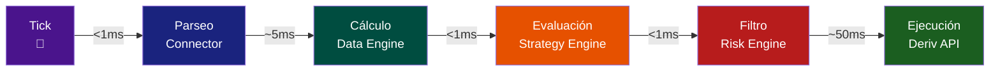

# 🏗️ Plan de Construcción — Ghost Trader

> **Versión:** 2.0 — 11/06/2026
> **Propósito:** Hoja de ruta para construir el asistente de trading en lenguaje natural, desglosado por módulos
> **Basado en:** Arquitectura v2 — Deriv API nativa

---

## 🧱 MÓDULOS DEL SISTEMA

```mermaid
flowchart TB
    subgraph DERIV[Mundo Exterior]
        A[Deriv API<br>ws.derivws.com]
    end

    subgraph GT[Ghost Trader — 1 Proceso Python]
        direction TB
        
        subgraph M1[📦 M1 — Deriv Connector]
            M1_WS[WebSocket persistente]
            M1_TICK[TickEvent]
            M1_ORDEN[Orden buy/sell]
        end

        subgraph M2[📦 M2 — Data Engine]
            M2_BUF[Buffer de ticks]
            M2_VELA[Agrupación → Velas]
            M2_IND[Indicadores<br>RSI · EMA · SMA · ATR · Vol]
        end

        subgraph M3[📦 M3 — Backtest Engine]
            M3_HIST[Datos históricos<br>ticks_history]
            M3_SIM[Simulación vela x vela]
            M3_MET[Métricas<br>Sharpe · Sortino · DD · PF]
        end

        subgraph M4[📦 M4 — Strategy Engine]
            M4_ABS[Clase abstracta Strategy]
            M4_EMA[EMACross]
            M4_RSI[RSIStrategy]
            M4_DYN[Dynamic JSON]
            M4_SIG[OrderSignal]
        end

        subgraph M5[📦 M5 — Risk Engine]
            M5_R1[🔴 Max pérdida diaria -2%]
            M5_R2[🔴 Max posiciones 3]
            M5_R3[🔴 Stop Loss obligatorio]
            M5_R4[🟡 Horario 08-20 UTC]
            M5_R5[🔴 Margen suficiente]
            M5_OK[✅ ApprovedOrder]
        end

        subgraph M6[📦 M6 — HTTP API :9001]
            M6_PRICE[GET /price/{symbol}]
            M6_IND[GET /indicator/{name}]
            M6_CAND[GET /candles/{symbol}]
            M6_ORDER[POST /order]
            M6_POS[GET /positions]
            M6_ACC[GET /account]
            M6_BT[POST /backtest]
        end
    end

    subgraph OPENCLAW[Capa de Interacción — OpenClaw]
        TG[💬 Telegram]
        LLM[🧠 LLM<br>DeepSeek → OpenAI → Claude]
        TF[⚙️ TaskFlow<br>Estrategias autónomas]
        SK[🔌 Skills HTTP thin]
    end

    %% Conexiones del flujo de datos
    A <-->|WebSocket SSL| M1_WS
    M1_WS -->|TickEvent| M2_BUF
    M2_BUF --> M2_VELA --> M2_IND
    M2_IND -->|IndicatorSnapshot| M4_ABS
    M4_ABS --> M4_EMA & M4_RSI & M4_DYN
    M4_EMA & M4_RSI & M4_DYN -->|OrderSignal| M5_R1
    M5_R1 --> M5_R2 --> M5_R3 --> M5_R4 --> M5_R5
    M5_R5 -->|Si todo OK| M5_OK
    M5_OK -->|ApprovedOrder| M1_ORDEN
    M1_ORDEN -->|buy/sell JSON-RPC| A
    M1_WS -.->|Datos históricos| M3_HIST
    M3_HIST --> M3_SIM --> M3_MET
    M3_MET -.->|Feedback| M4_ABS

    %% HTTP API conecciones
    M1_WS -.->|Precio en vivo| M6_PRICE
    M2_IND -.->|Indicadores| M6_IND
    M2_VELA -.->|Velas| M6_CAND
    M5_OK -.->|Orden aprobada| M6_ORDER
    M1_ORDEN -.->|Posiciones abiertas| M6_POS

    %% OpenClaw conecciones
    TG -->|"compra 10 EURUSD"| LLM
    LLM -->|OrderSignal| M5_R1
    LLM -.->|Consulta de datos| SK
    SK <--> M6_PRICE & M6_IND & M6_ORDER & M6_POS
    TF -.->|Estrategia automática| M4_ABS

    %% Estilos
    classDef danger fill:#ff4444,color:#fff
    classDef ok fill:#00C853,color:#fff
    classDef warning fill:#FFC107,color:#000
    classDef module fill:#1a1a2e,stroke:#e94560,color:#eee
    classDef openclaw fill:#16213e,stroke:#0f3460,color:#eee
    class M5_R1,M5_R2,M5_R3,M5_R5 danger
    class M5_OK ok
    class M5_R4 warning
    class M1,M2,M3,M4,M5,M6 module
    class TG,LLM,TF,SK openclaw
```

### Leyenda del Diagrama

| Símbolo | Significado |
|---------|------------|
| ➡️ Flecha sólida | Flujo principal de datos (tick → orden) |
| ┄ ➡️ Flecha punteada | Flujo secundario / consulta |
| 🔴 Rojo | Regla crítica de seguridad |
| 🟢 Verde | Punto de aprobación |
| 🟡 Amarillo | Regla opcional / informativa |

### Pipeline de Datos — Tick a Orden (Tiempos Estimados)



**Latencia total estimada Tick → Orden:** ~60ms
```

---

## 📦 Módulo 1 — Deriv Connector

**Función:** Puente único entre Deriv y el sistema. WebSocket persistente.

| Sub-componente | Estado | Prioridad |
|---------------|--------|-----------|
| Conexión WebSocket a Deriv Demo | ⏳ | 🔴 |
| Suscripción a ticks (1RDN8Z3) | ⏳ | 🔴 |
| Suscripción a balance/profit | ⏳ | 🔴 |
| Dataclasses internas (models.py) | ⏳ | 🔴 |
| Auto-reconnect (backoff exponencial) | ⏳ | 🟡 |
| Parseo de mensajes JSON-RPC | ⏳ | 🔴 |

**Dependencias:** `websockets`, `orjson`

---

## 📦 Módulo 2 — Data Engine

**Función:** Cálculos financieros con Polars. Corazón analítico.

| Sub-componente | Estado | Prioridad |
|---------------|--------|-----------|
| Buffer de ticks → agrupación por intervalo | ⏳ | 🔴 |
| RSI(14) — Wilder's Smoothing | ⏳ | 🔴 |
| EMA(12) — Exponential Moving Average | ⏳ | 🔴 |
| SMA(50) — Simple Moving Average | ⏳ | 🟡 |
| ATR(14) — Average True Range | ⏳ | 🟡 |
| Volatilidad (desviación estándar de retornos) | ⏳ | 🟡 |
| Modo batch (500 velas históricas) | ⏳ | 🟡 |
| Modo streaming (por tick) | ⏳ | 🔴 |

**Dependencias:** `polars`, `numpy`

---

## 📦 Módulo 3 — Backtest Engine

**Función:** Simulación vela por vela con datos reales Deriv.

| Sub-componente | Estado | Prioridad |
|---------------|--------|-----------|
| Obtener ticks_history de Deriv | ⏳ | 🔴 |
| Simulación vela por vela | ⏳ | 🔴 |
| Slippage + comisiones | ⏳ | 🟡 |
| Spread variable | ⏳ | 🟡 |
| Métricas: Sharpe, Sortino, Profit Factor, DD | ⏳ | 🟡 |

**Dependencias:** Módulo 2 (Data Engine)

---

## 📦 Módulo 4 — Strategy Engine

**Función:** Estrategias OOP. Evalúa reglas y genera señales.

| Sub-componente | Estado | Prioridad |
|---------------|--------|-----------|
| Clase abstracta Strategy | ⏳ | 🔴 |
| EMACross (EMA_12 cruza SMA_50) | ⏳ | 🔴 |
| RSIStrategy (RSI < 30 compra, > 70 vende) | ⏳ | 🟡 |
| Dynamic (reglas JSON configurables) | ⏳ | 🟡 |
| Evaluación O(1) por tick | ⏳ | 🔴 |

**Dependencias:** Módulo 2 (IndicatorSnapshot)

---

## 📦 Módulo 5 — Risk Engine

**Función:** Último filtro de seguridad. NO HAY BYPASS.

| Regla | Estado | Prioridad |
|-------|--------|-----------|
| Máx pérdida diaria (-2% del balance) | ⏳ | 🔴 |
| Máx posiciones abiertas (3) | ⏳ | 🔴 |
| Stop Loss obligatorio | ⏳ | 🔴 |
| Horario permitido (08:00-20:00 UTC) | ⏳ | 🟡 |
| Margen suficiente | ⏳ | 🔴 |
| Short-circuit (falla una → rechazada) | ⏳ | 🟡 |

**Regla de oro:** Risk Engine aplica a TODAS las órdenes — automáticas, manuales y por LLM.

---

## 📦 Módulo 6 — HTTP API (localhost:9001)

**Función:** Endpoints para que OpenClaw consuma.

| Endpoint | Estado | Prioridad |
|----------|--------|-----------|
| GET /price/{symbol} | ⏳ | 🔴 |
| GET /indicator/{name}/{symbol} | ⏳ | 🟡 |
| GET /candles/{symbol} | ⏳ | 🟡 |
| POST /order | ⏳ | 🔴 |
| POST /backtest | ⏳ | 🟡 |
| POST /strategy/{action} | ⏳ | 🟡 |
| GET /positions | ⏳ | 🟡 |
| GET /account | ⏳ | 🔴 |

**Dependencias:** Flask/FastAPI (liviano)

---

## 📦 Módulo 7 — OpenClaw (Capa de Interacción)

**Función:** Interface con usted vía Telegram + LLM.

| Sub-componente | Estado | Prioridad |
|---------------|--------|-----------|
| Skills HTTP thin (máx 15 líneas c/u) | ⏳ | 🟡 |
| Telegram → LLM interpreta → POST /order | ⏳ | 🔴 |
| TaskFlow (estrategias autónomas) | ⏳ | 🟡 |
| LLM intercambiable (DeepSeek → OpenAI → Claude) | ✅ | 🟢 |

---

## 🪜 ORDEN DE CONSTRUCCIÓN (Fases)

### Fase 1 — Fundación 🔴 (~2h)
Basado en el plan original de la arquitectura:

| Paso | Qué | Módulos | Tiempo |
|------|-----|---------|--------|
| 1 | Crear repo GitHub + estructura inicial | — | 15 min |
| 2 | Conexión WebSocket a Deriv Demo | M1 | 30 min |
| 3 | Tick en vivo + notificación por Telegram | M1 + M7 | 30 min |
| 4 | Data Engine básico + POST /order en demo | M2 + M6 | 1h |

**Checkpoint:** Usted ve un tick en Telegram y puede hacer una orden manual.

### Fase 2 — Núcleo Funcional 🟡 (~3h)

| Paso | Qué | Módulos | Tiempo |
|------|-----|---------|--------|
| 5 | Backtest Engine completo | M3 | 2h |
| 6 | Risk Engine operativo | M5 | 30 min |
| 7 | Strategy Engine funcional | M4 | 1h |

**Checkpoint:** Una estrategia completa ciclo cerrado (tick → indicador → evaluar → arriesgar → orden).

### Fase 3 — Integración y Optimización 🟢 (~2h)

| Paso | Qué | Módulos | Tiempo |
|------|-----|---------|--------|
| 8 | Refinamiento: logs, errores, tests | Todo | 1h |
| 9 | TaskFlow para estrategias autónomas | M7 | 30 min |
| 10 | Pruebas en mercado real (capital mínimo) | Todo | — |

**Checkpoint:** Ghost Trader ejecutando en vivo con supervisión.

---

## 📊 Estado General del Proyecto

| Módulo | Avance | Prioridad |
|--------|--------|-----------|
| M1 — Deriv Connector | 0% | 🔴 |
| M2 — Data Engine | 0% | 🔴 |
| M3 — Backtest Engine | 0% | 🟡 |
| M4 — Strategy Engine | 0% | 🔴 |
| M5 — Risk Engine | 0% | 🔴 |
| M6 — HTTP API | 0% | 🔴 |
| M7 — OpenClaw Layer | 10% | 🟡 |
| Arquitectura documentada | 100% | ✅ |
| Flujo de datos documentado | 100% | ✅ |
| Prácticas profesionales | 100% | ✅ |

---

## 📌 Tareas Inmediatas

- [ ] **⬆️ 🔴 HOY:** Backtest estrategia base con datos reales Deriv
- [ ] **⬆️ 🔴 HOY:** Definir parámetros de riesgo iniciales
- [ ] Crear repositorio GitHub + estructura
- [ ] Investigar N8N como alternativa de orquestación — *Evolución MT5.md*
- [ ] Ciclo de trabajo 🔁 — *Evolución MT5.md*

---

## 🔗 Notas Relacionadas

- [[Arquitectura Ghost Trader]]
- [[🌀 Ghost Trader — Flujo de Datos (Arquitectura Limpia)]]
- [[Evolución MT5]]
- [[Análisis assistentLLM]]
