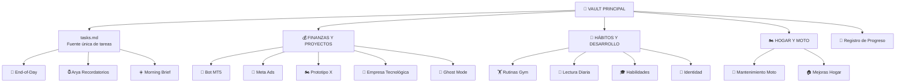
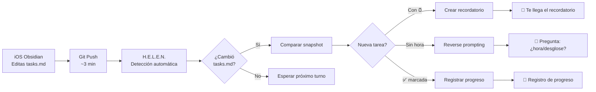
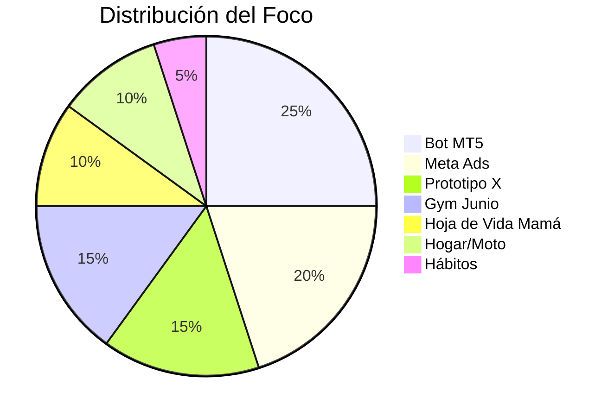

# 🗺️ Mapa del Vault

> Diagrama visual de la estructura del vault. Renderizado con Mermaid.

## 📋 Estructura General

## 🔥 Flujo Diario

## 🏋️ Rutina Semanal

```mermaid
gantt
    title Rutina Gym — Junio 2026
    dateFormat HH:mm
    axisFormat %H:%M

    section Lunes
    Tren Superior Completo    :lun, 07:00, 90m

    section Martes
    Pierna 1 (Cuádriceps)     :mar, 07:00, 80m

    section Miércoles
    Espalda + Bíceps          :mie, 07:00, 85m

    section Jueves
    Pecho + Tríceps           :jue, 07:00, 85m

    section Viernes
    Pierna 2 (Isquiotibiales) :vie, 07:00, 85m
```

## 📊 Proyectos Activos

---

*Mapa generado el 09/06/2026. Actualizar cuando cambie la estructura del vault.*
